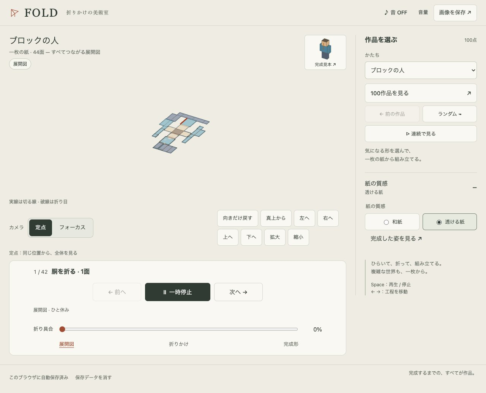

# FOLD — 折りかけの美術室

一枚の展開図が、少しずつ立体になる様子を眺めるブラウザアプリです。
人・ねこ・ロケットなどの基本形と、100点の立体で遊べます。



## 起動する

Node.js 24以上とPython 3を用意し、このフォルダで実行します。

```sh
npm ci
npm start
```

[アプリを開く](http://127.0.0.1:8766/fold.html)。終了はターミナルで Ctrl+C。

## 遊び方

- **作品を選ぶ**：一覧や「ランダムに次へ」で形を変える。「連続で見る」で100点を順に見る。
- **折る**：再生すると一つずつ折れる。停止して、前後の工程やスライダーで確かめる。
- **見る**：ドラッグで回転、スクロールで拡大。「フォーカス」は折り目を斜めから追う。
- **絵と音**：好きな画像を紙にのせる。音は「音 ON」で開始。表示中の姿はPNGで保存できる。
- **ことばで作る**：「赤い、背の高いロボット」などで形・色・背丈を指定する。

選んだ作品や折り具合は、同じブラウザ・同じURLで再開できます。
キーボードは模型を選択して、Spaceで再生・停止、左右キーで工程移動、Rで視点を戻します。
「向き」の回転・拡大縮小ボタンも、Tabで選んでEnterで操作できます。
保存した画像・設定を消すには、画面下の「保存データを消す」を使います。他のFOLDのタブも閉じてください。

## 試作の範囲

「ことばで作る」は、用意した形を組み合わせるモックです。未知の形をAIで作る機能ではありません。
展開図のつながりと平面での重なりを検査していますが、折る途中の衝突や、実際の紙で作れるかは判定しません。

## 公開する

静的サイトとして動きます。GitHub Pagesでは、リポジトリの **Settings → Pages → Build and deployment → Source** を **GitHub Actions** に設定してください。
この設定はGitHubの画面で一度変更する必要があります。`Deploy from a branch` のままでは、チェック成功前に公開される既存の経路が残ります。

設定後は、`main` へのpushで `Check` の構文・Lint・整形・Node.jsテスト・E2Eが成功すると公開します。
初回や再公開は **Actions → Check → Run workflow** で `main` を選んで実行できます。プルリクエストや他のブランチは検証だけを行います。
公開するのは `dist/` と入口・404・サイトマップ・ライセンスです。テスト・ツール・検証画像は含めません。
トップの `index.html` から `dist/fold.html` が開くため、公開URLは変わりません。別の静的ホストでは `dist/` だけを公開することもできます。

画像はブラウザ内で読み込み・保存します。外部APIやAPIキーは使いません。

favicon、スマホのホーム画面用アイコン、共有用画像・OGP、JSON-LD、サイトマップを同梱しています。
公開先を変えるときは、3つのHTMLの公開URL、JSON-LD、`sitemap.xml`、`404.html` のリンクを更新してください。

## 開発する

```sh
npm run check          # JavaScriptの構文確認
npm test               # 形状・描画部品・画像・保存のテスト
npm run verify         # 構文・Lint・整形・テストをまとめて確認
npm run format         # 自作コードと文書の整形
npm run generate:collection  # 100点のデータと見本画像を作り直す
```

実ブラウザで確認する場合は、初回にChromiumを用意します。

```sh
npx playwright install chromium
npm run test:e2e
```

E2Eは専用の静的サーバーを起動し、画像の通信失敗、キー操作、PNG保存、画像の復元、音の切り替え、スマホの道具を確認します。
Chromiumのソフトウェア描画を使います。Safariや実機の音声中断は別途確認が必要です。
失敗時のトレースは `test-results/` に保存します。

pushとプルリクエストでも、GitHub Actionsが `npm run verify` とE2Eを実行します。
同梱ライブラリと生成データは整形対象から外しています。

展開図は通常、同梱データを使います。作り直す場合は `buildPaperModel(spec, { useCache: false })`、
保存した展開図を復元する場合は `buildPaperModel(spec, { net })` を使います。
生成スクリプトは同梱キャッシュを使わず、`--resume` の場合だけ途中保存から再開します。

コードは役割ごとに分けています。画面を読むなら `dist/js/fold.js` から始めてください。

| ファイル（`dist/js/`内）                                 | 担当                                     |
| -------------------------------------------------------- | ---------------------------------------- |
| `fold.js`                                                | 起動、操作、再生、保存の連携             |
| `fold-gallery.js` / `fold-artwork.js`                    | 作品選びと履歴 / 画像の読み込みと保存    |
| `fold-history.js` / `fold-lifecycle.js`                  | 作品履歴 / 起動と保存・復元の順序        |
| `fold-recipes.js` / `fold-collection.js`                 | 基本形と100点の形状レシピ                |
| `fold-topology.js` / `fold-net.js` / `fold-models.js`    | 外側の面 / 展開と回転 / モデルの組み立て |
| `fold-view.js` / `fold-paper-mesh.js`                    | カメラと描画 / 紙・線・材質              |
| `fold-sequence.js` / `fold-session.js` / `fold-audio.js` | 折る順番 / 保存 / 音                     |

フォルダの役割：

- `dist/`：公開する画面・画像・Three.js。アプリのコードは `dist/js/`。
- `tests/`：Node.jsのテスト。
- `tools/`：構文確認と100作品の生成スクリプト。
- `qa/`：検証画像。

ローカルの起動にはPython標準の静的HTTPサーバーを使います。専用サーバーやビルドは不要です。
検証画像は `qa/fold/`、生成した鶴の画像と制作情報は `dist/images/fold/` にあります。

## ライセンス

[MIT](LICENSE)。同梱のThree.jsもMITで、著作権表示は [THREE-LICENSE.txt](dist/vendor/THREE-LICENSE.txt) に残しています。
